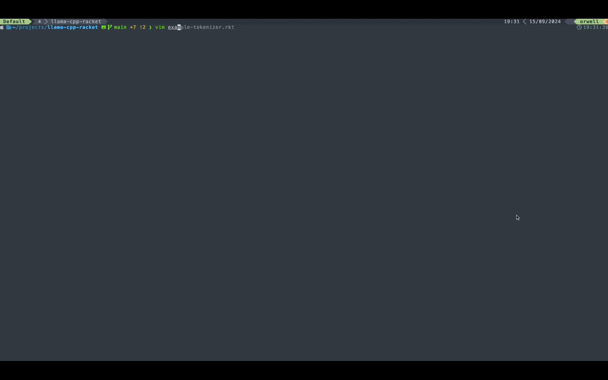
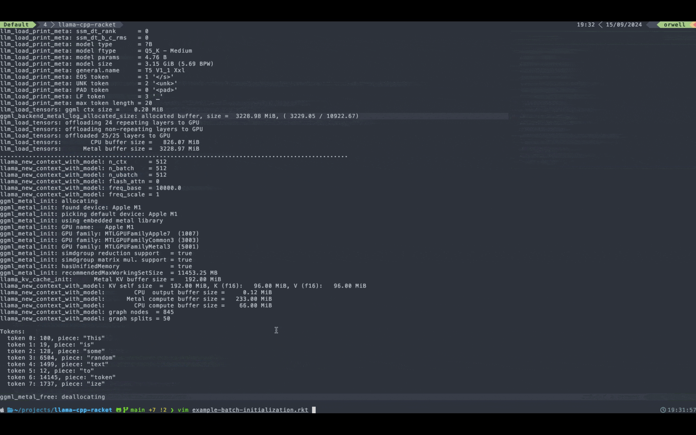

# llama.cpp over FFI into Racket

This repository contains hand-made bindings for some of the functions from llama.h, allowing to use it with FFI.  
I am not planning to maintain it in the near future. I made it for my other project and it might be incomplete for other use-cases.  
But please feel free to do whatever you want with it!!! and let me know if you wanna add something.  
  
It assumes .dylib is used, so it's tested on MacOS only, but I'm pretty sure it could work with other architectures, too. 
The only requirement would be to update *build* section in Makefile accordingly.  


It was last tested with [llama.cpp release b3756](https://github.com/ggerganov/llama.cpp/releases/tag/b3756),
but I suspect it will work with any version.  


Please note, I'm a noob and this repo might be incorrect. Use at your own risk :)  


# Important

Once you build the project, you can get rid of everything apart from:  
- *libllama.dylib* - main dependency, containing llama.cpp code  
- *racket.rkt* - contains the bindings that allow to call functions from above library  

You need to have installed [ffi/unsafe library](https://docs.racket-lang.org/foreign/index.html) for racket.  
The examples at the end show how you can incorporate it within your project.  


# Usage

1. Initialize *llama.cpp* submodule:  

```
make update
```

2. Build *libllama.dylib* library:  

```
make build
```

If you changed something in llama.cpp source code (or updated submodule again) and want to rebuild, use this:  

```
make rebuild
```

*rebuild* can be executed multiple times. It basically clears the state and builds libllama again.  
  
  
In any case the lib will be placed in main directory as *libllama.dylib*  

3. Download a llama.cpp compatible model.  

4. Once the project is built, you can use it with *llama.rkt*. See, examples below.  

# Examples

Both examples below load bindings from *llama.rkt* and take *model.gguf* from main dir (I use [city96/t5-v1_1-xxl-encoder-gguf](https://huggingface.co/city96/t5-v1_1-xxl-encoder-gguf)).

```
racket ./example-tokenizer.rkt
```



```
racket ./example-batch-initialization.rkt
```




